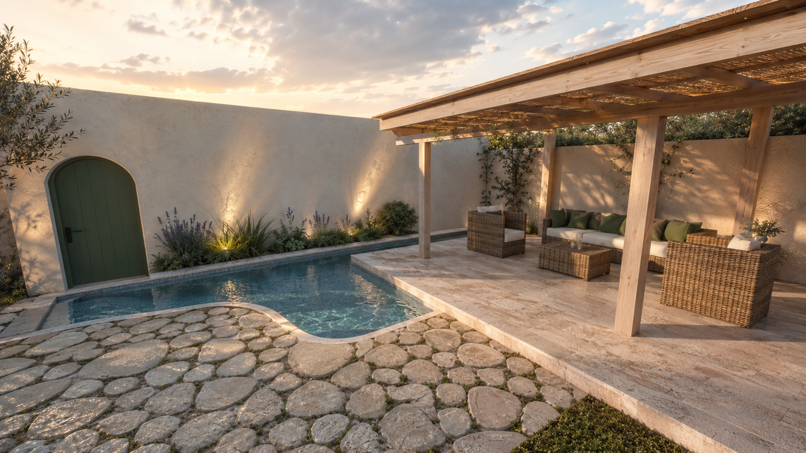

# Portfolio — Asma Kamel Thabti

Portfolio web d’**Asma Kamel Thabti**, designer d’intérieur diplômée basée à Gabès, Tunisie.

Le site présente ses projets résidentiels et commerciaux à travers des rendus 3D, plans architecturaux, études techniques, palettes de matériaux et vidéos de visualisation.

## Démonstration

- [Voir le portfolio sur Vercel](https://asma-portfolio-neon.vercel.app)
- [Voir les huit projets](https://asma-portfolio-neon.vercel.app/projects)
- [Voir le portfolio en ligne](https://asma-kamel-thabti-portfolio.iheb-jlassi.chatgpt.site)
- [Voir tous les projets](https://asma-kamel-thabti-portfolio.iheb-jlassi.chatgpt.site/projects.html)



## Fonctionnalités

- Interface entièrement en français
- Design architectural responsive inspiré d’une planche technique
- Page d’accueil avec projets sélectionnés et filtres par catégorie
- Page dédiée regroupant huit études résidentielles, commerciales et techniques
- Galeries modales avec images, plans, palettes et vidéos
- Sélection de planches techniques extraites des dossiers PDF
- Navigation clavier dans les galeries
- Mise en page optimisée pour ordinateur, tablette et mobile
- Liens de contact directs par e-mail et téléphone
- Prise en charge de la préférence `prefers-reduced-motion`

## Technologies

- React 19
- Vite 6
- CSS responsive sans framework visuel
- Phosphor Icons
- Barlow Condensed et IBM Plex Mono via Fontsource

## Installation locale

Prérequis : Node.js et npm.

```bash
git clone https://github.com/HebhebJ/asma_portfolio.git
cd asma_portfolio
npm install
npm run dev
```

Le serveur local est ensuite accessible à l’adresse indiquée par Vite.

## Commandes

```bash
# Développement
npm run dev

# Build pour OpenAI Sites
npm run build

# Build statique pour Vercel
npm run build:vercel

# Prévisualisation du build
npm run preview
```

Le fichier `vercel.json` sélectionne automatiquement le build statique et publie
le dossier `dist`.

## Structure principale

```text
.
├── public/assets/          # Rendus, plans, portrait et vidéos
├── scripts/                # Préparation du package de déploiement
├── src/
│   ├── App.jsx             # Accueil, données projets et galerie
│   ├── ProjectsPage.jsx    # Index complet des projets
│   ├── main.jsx
│   ├── projects-main.jsx
│   └── styles.css
├── index.html
├── projects.html
└── vite.config.mjs
```

## Identité et contact

**Asma Kamel Thabti**  
Designer d’intérieur — conception 2D/3D et visualisation intérieure  
Gabès, Tunisie  
[asmakamelthabti@gmail.com](mailto:asmakamelthabti@gmail.com)

---

Conçu pour mettre en valeur le passage de la première ligne à l’atmosphère finale.
